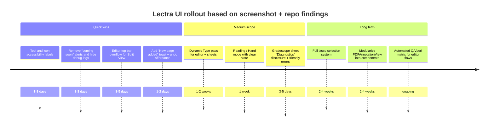

# UI Improvement Opportunities in Lectra Based on Current Screenshots and Repo Review

## Executive summary

Across the 18 screenshots you attached, Lectra already presents a cohesive “premium dark” aesthetic (glassy surfaces, rounded cards, pill toolbars) and a clear core flow: **Library → open PDF → annotate with Apple Pencil → export/share/submit**. The **PDF editor** in particular is already unusually capable: it supports **Undo/Redo (including keyboard shortcuts), document title rename, sync status badges, PDF search, PDF outline, handwriting tool palette, Apple Pencil squeeze actions, and multi-page paging with auto-append blank pages**. fileciteturn133file0L1-L1 fileciteturn147file0L1-L1

The biggest UI gaps visible in screenshots and corroborated by the implementation are:

- **Learnability + accessibility**: key icon-only controls (especially drawing tools) lack explicit labels and robust “adaptive” behaviors (Dynamic Type, VoiceOver completeness, keyboard/pointer affordances). Apple’s VoiceOver guidance expects **concise, accurate labels for controls**. citeturn1search1 citeturn9search0
- **Tooling honesty**: the UI advertises a **Lasso** (and even coach messaging), but the current drawing engine treats lasso as a non-drawing mode without selection UX; this creates trust issues for students who expect selection/move/resize. fileciteturn136file0L1-L1 fileciteturn133file0L1-L1
- **Responsiveness in iPad multitasking**: the editor top bar is action-dense; in Split View / smaller widths, it will likely overflow unless it collapses into an overflow menu by size class. Apple recommends adapting UI to trait changes/size classes. citeturn1search0 citeturn9search9
- **Debug/“coming soon” leakage into production UI**: multiple screens show developer-facing logs or placeholder alerts (“Notifications panel is coming soon.”, Gradescope logs). These should be gated behind a debug flag or replaced with student-friendly messaging.

## Sources and connector coverage

Connectors used (in your requested order): **Vercel → Slack → Google Calendar → Gmail → SlidesGPT → Canva → GitHub → Figma → Google Drive**.

- **Vercel**: team exists; no relevant deployment artifacts surfaced for this iPad app UI review.
- **Slack / Calendar / Gmail / Google Drive / Canva / SlidesGPT**: no relevant design artifacts or UI discussions were found in this pass.
- **Figma**: account is authenticated; no Lectra editor comps were discoverable from repo-linked identifiers in this pass (design comps remain **unspecified**).
- **GitHub**: primary evidence source; the PDF editor and design token system are implemented in-repo. Key files include the PDF editor view/controller, the floating tool picker, tool enums, and centralized tokens. fileciteturn133file0L1-L1 fileciteturn135file0L1-L1 fileciteturn136file0L1-L1 fileciteturn140file0L1-L1

Web sources used after connectors: Apple Human Interface Guidelines and Developer Docs, plus W3C WCAG/WCAG2ICT.

## Screenshot-based UI observations

### Library and navigation surfaces

Your screenshots show a **GoodNotes-inspired library grid** (Documents), a left sidebar for primary sections (Documents / Course Brain / Gradescope), and “Select” + “New” actions that open a multi-action create/import menu. The menu design is clean and familiar, but there are two trust issues:

- **Feature stubs surfaced as alerts** (“Notifications panel is coming soon.”). In a student tool, this reads like a broken button rather than a roadmap.
- **Developer diagnostics shown in primary surfaces** (Gradescope page log output). Debug output is valuable, but it should be hidden behind an “Advanced diagnostics” disclosure or debug build flag.

### PDF editor surface

The editor screenshots show a strong baseline:

- A top bar with **Back to Vault**, title (“Tap to rename”), a **sync badge** (“Synced”), export targets (**Canvascope**, **Gradescope**) and a settings menu containing **Search This PDF**, **Handedness**, and **Pencil Squeeze**.
- A floating compact tool picker for **Pen / Highlighter / Eraser / Lasso**, stroke thickness, and color swatches.
- A Gradescope submission sheet with **preflight**, **assignment picking**, and **upload gating via confirmation**—good guardrails.

The primary UI friction points visible in screenshots are:
- **Icon-only tool palette**: fast for experts but harsh for new users; tool names, selected state, and discoverable customization need to be clearer.
- **Editor chrome density**: the top bar has many actions; it needs responsive collapse behavior for Split View/Stage Manager.
- **Gradescope sheet exposes “Diagnostics” by default**: good for troubleshooting, but likely too technical for most students; should be behind “Show details”.

## Repo-grounded UI findings that directly affect UX

### PDF editor implementation is centralized and sophisticated

The PDF editor is primarily implemented in `PDFAnnotationView.swift`, which includes:
- A SwiftUI wrapper, a UIKit bridge (`UIViewControllerRepresentable`), and a custom controller (`PageAnnotationViewController`) with multi-page layout, zoom/pan behaviors, and a custom vector-ink renderer. fileciteturn133file0L1-L1
- A floating tool picker UI (`FloatingToolPickerView.swift`). fileciteturn135file0L1-L1
- Tool definitions (`AnnotationTool.swift`) showing Pen/Highlighter/Eraser/Lasso and ink colors. fileciteturn136file0L1-L1
- Local persistence conventions for `original.pdf`, `annotated.pdf`, and `drawings.dat`. fileciteturn137file0L1-L1

This aligns with your spec’s intended workflow (push → fetch → annotate → sync/review). fileciteturn147file0L1-L1

### Design tokens exist, but editor currently mixes token and non-token colors

`LectraTheme.swift` establishes centralized tokens (colors, spacing, motion, min hit target). fileciteturn140file0L1-L1  
But the editor currently uses both:
- Token accent `LectraColor.accent` (#FF5A2A) from the theme tokens. fileciteturn140file0L1-L1
- Ink “accent” as Canvascope-red (#E02520) inside `AnnotationInkColor`. fileciteturn136file0L1-L1

This can produce subtle but real “brand drift” (toolbar selection gradients vs. ink swatches vs. call-to-action colors), visible in screenshots as slightly different reds across surfaces.

### “Lasso” exists as a tool option, but selection UX is not implemented

The tool picker exposes Lasso; the tool enum includes `.lasso`. fileciteturn135file0L1-L1 fileciteturn136file0L1-L1  
However, the current vector ink canvas treats lasso as a distinct mode but doesn’t provide selection/move/resize affordances; additionally, the UI logic often “snaps” away from lasso back to pen during color/thickness selection. This mismatch is a high-priority trust and usability bug for annotation workflows.

### iPad multitasking is a first-class requirement, not optional

Apple’s iPad multitasking behavior changes scene/window sizes; apps should adapt layout to trait changes rather than relying on fixed widths. citeturn1search0 citeturn9search9  
Your UI is already iPad-first, but the editor top bar needs a width-aware overflow strategy.

## Prioritized, actionable UI improvements

Effort and impact are estimated relative to the current architecture and what’s visible in screenshots.

### Top 10 changes table

| Change | Category | Effort | Impact | Key files/locations |
|---|---|---|---|---|
| Add explicit accessibility labels/hints and “selected” traits for tool buttons (Pen/Highlighter/Eraser/Lasso), undo/redo, share, and export buttons | Accessibility | Low | High | `FloatingToolPickerView.swift`, `PDFAnnotationView.swift` fileciteturn135file0L1-L1 fileciteturn133file0L1-L1 |
| Replace lasso “placeholder” behavior with real selection UX (select strokes → move/resize/delete/copy) or hide Lasso until implemented | Tools & Interaction | High | High | `AnnotationTool.swift`, `PDFAnnotationView.swift` fileciteturn136file0L1-L1 fileciteturn133file0L1-L1 |
| Add Split View / narrow-width top bar collapse (group Canvascope/Gradescope/Share into overflow menu when needed) | Responsiveness | Medium | High | `PDFAnnotationView.swift` fileciteturn133file0L1-L1 |
| Stop showing “coming soon” alerts and debug logs in production UI; replace with disabled state + short explanation, or hide behind debug toggle | Interaction & Feedback | Low–Medium | High | (Library/Gradescope views; exact files unspecified from this pass) |
| Unify brand accent usage (theme vs. ink accent) and eliminate hardcoded reds in editor chrome | Visual Consistency | Medium | Medium–High | `LectraTheme.swift`, `AnnotationTool.swift`, `FloatingToolPickerView.swift` fileciteturn140file0L1-L1 fileciteturn136file0L1-L1 fileciteturn135file0L1-L1 |
| Add a “Reading / Hand mode” control (lock ink; allow gesture navigation without accidental marks) with clear state indicator | Tools & Interaction | Medium | High | `PDFAnnotationView.swift` fileciteturn133file0L1-L1 |
| Improve save/sync UX: reduce blocking overlay usage; show progress + allow background save when safe; add “status announcements” for accessibility | Performance & Feedback | Medium | High | `PDFAnnotationView.swift`, `DocumentServices.swift` fileciteturn133file0L1-L1 fileciteturn138file0L1-L1 |
| Add highlighter-friendly defaults (yellow option, opacity control, quick thickness presets) | Tools & Interaction | Low–Medium | Medium–High | `AnnotationTool.swift`, `FloatingToolPickerView.swift` fileciteturn136file0L1-L1 fileciteturn135file0L1-L1 |
| Add “New page added” toast when auto-append triggers (spec callout), with undo option | Interaction & Feedback | Low | Medium | `PDFAnnotationView.swift` fileciteturn133file0L1-L1 fileciteturn147file0L1-L1 |
| Add UI test + QA matrix for editor: Split View sizes, rotation, large text, VoiceOver, Pencil squeeze, export/submit | Testing & QA | Medium | High | (Test targets unspecified; editor entry points in `PDFAnnotationView.swift`) fileciteturn133file0L1-L1 |

### Accessibility improvements

- **Label everything actionable, especially icon-only controls.**  
  Rationale: Apple’s VoiceOver guidance explicitly calls for “alternative labels for all key interface elements” and concise, accurate labels. citeturn1search1  
  Effort: Low. Impact: High.  
  Where: Tool buttons in the floating palette; undo/redo/share; overflow menu actions. fileciteturn135file0L1-L1 fileciteturn133file0L1-L1

- **Dynamic Type and minimum readable text sizing across overlays and sheets.**  
  Rationale: Your UI uses many fixed-point fonts; WCAG’s “Resize text” expectation (web) maps to the same principle: text should scale without losing functionality. citeturn3search2  
  Effort: Medium. Impact: High.

- **Target sizing/spacing: ensure 44×44pt hit targets and adequate spacing in dense toolbars.**  
  Rationale: Apple recommends 44pt minimum hit targets. citeturn9search5  
  Effort: Low. Impact: Medium–High.

- **Announce status changes (saving/uploading/synced/failed) for assistive tech.**  
  Rationale: VoiceOver users can miss silent state changes; Apple discusses reporting visible changes, and WCAG highlights “status message” expectations in general. citeturn1search1 citeturn3search2  
  Effort: Medium. Impact: High.

### Tools and interaction improvements

- **Make Lasso real or remove it until it’s real.**  
  Rationale: Students expect lasso selection to move/resize/delete/copy handwriting; a “fake lasso” breaks trust quickly.  
  Effort: High. Impact: High.  
  Where: Tool enum + tool picker + vector ink canvas. fileciteturn136file0L1-L1 fileciteturn135file0L1-L1 fileciteturn133file0L1-L1

- **Add a dedicated “Reading / Hand mode” with obvious state indicator.**  
  Rationale: Students oscillate between reading and writing; a single-tap lock prevents accidental marks and reduces cognitive load.  
  Effort: Medium. Impact: High.  
  Where: Editor top bar and tool logic. fileciteturn133file0L1-L1

- **Improve tool discoverability with lightweight labels/coach marks that fade after first use.**  
  Rationale: The pill toolbar is elegant but opaque to first-time users; subtle labels (“Pen”, “Highlighter”) shown for ~1–2 seconds after selection preserve the premium feel while accelerating learning.  
  Effort: Low–Medium. Impact: Medium–High.  

- **Refine “Gradescope Submit” dialog: hide diagnostics behind “Show details” and present student-friendly error summaries first.**  
  Rationale: The current sheet UX is structurally good (preflight, confirmation gate), but diagnostics logs read as developer output; students need actionable next steps.  
  Effort: Low–Medium. Impact: High.

### Visual consistency improvements

- **Unify accent color strategy: theme tokens vs. ink palette.**  
  Rationale: `LectraTheme` defines a brand accent, but the ink “accent” is a different red; unify to avoid subtle inconsistency across the app. fileciteturn140file0L1-L1 fileciteturn136file0L1-L1  
  Effort: Medium. Impact: Medium–High.

- **Add a highlighter-default yellow and a couple of “student standard” presets.**  
  Rationale: Students predominantly highlight in yellow; giving it first-class support reduces friction dramatically.  
  Effort: Low–Medium. Impact: Medium–High.  
  Where: ink color enum and palette. fileciteturn136file0L1-L1 fileciteturn135file0L1-L1

### Layout and responsiveness improvements

- **Collapsed editor top bar for Split View: overflow menu for secondary actions.**  
  Rationale: iPad multitasking changes window widths; Apple recommends adapting using trait environments (size classes). citeturn1search0 citeturn9search9  
  Effort: Medium. Impact: High.

- **Toolbar docking should avoid system gesture zones and keyboard overlays; persist per orientation/size class.**  
  Rationale: Your toolbar is dockable, but edge zones can conflict with swipe gestures and Stage Manager resizing. Trait-based layout is a standard approach. citeturn1search0  
  Effort: Medium. Impact: Medium–High.  
  Where: docking logic in editor view. fileciteturn133file0L1-L1

### Performance and loading improvements

- **Reduce blocking “Saving & Syncing” overlays; reserve for truly blocking transitions.**  
  Rationale: A hard overlay interrupts note flow; prefer a status badge + subtle progress unless leaving the screen. This also improves perceived performance.  
  Effort: Medium. Impact: High.  
  Where: editor save overlay and sync state mapping. fileciteturn133file0L1-L1 fileciteturn138file0L1-L1

- **Keep zoom crispness as a first-class QA criterion.**  
  Rationale: Your repo already documents the “PDF sharp, ink blurry” failure mode and why vector/tiled ink matters; formalize this as a regression test. fileciteturn149file0L1-L1  
  Effort: Medium. Impact: High.

### Code and maintainability improvements

- **Split `PDFAnnotationView.swift` into modules: View, Bridge, Controller, Rendering, Persistence.**  
  Rationale: The editor file mixes SwiftUI, UIKit bridging, rendering, persistence, and math-heavy scrolling logic—hard to evolve safely.  
  Effort: High. Impact: High.  
  Where: editor implementation file. fileciteturn133file0L1-L1

- **Enforce “tokens only” styling in UI reviews.**  
  Rationale: You already have centralized tokens; stop drift now before the app scales. fileciteturn140file0L1-L1  
  Effort: Medium. Impact: Medium–High.

### Testing and QA improvements

- **Create an editor QA matrix: Split View sizes, rotation, VoiceOver, large text, Pencil squeeze, export.**  
  Rationale: Apple explicitly frames accessibility as something to audit; iPad multitasking adds combinatorial layout risk. citeturn9search0 citeturn9search9  
  Effort: Medium. Impact: High.

## Implementation plan for an agent

Give the agent the Top 10 table as 10 tickets, each scoped to one surface and one quality axis. In week one, prioritize **low-effort/high-impact wins**: add missing accessibility labeling, replace “coming soon”/debug panes with production-safe patterns, and implement Split View collapsing for the editor top bar. In week two, tackle the **trust-critical interaction gap**: either implement lasso selection properly (select/move/delete/copy) or remove it from UI until complete, plus add a Reading/Hand mode. In week three+, do structural refactors (modularize `PDFAnnotationView.swift`) and add regression tests and performance checks (zoom crispness, large PDFs, save/export times), ensuring each change ships with screenshots in multiple iPad sizes, VoiceOver verification notes, and Split View recordings.

## Rollout timeline

## Reference resources used for evaluation

- Apple Human Interface Guidelines: Accessibility citeturn1search5turn9search0  
- Apple Human Interface Guidelines: VoiceOver guidance (labels, reporting changes) citeturn1search1  
- Apple UI Design Tips: 44pt hit targets, contrast, readability citeturn9search5  
- UIKit trait environment for adaptivity (`UITraitCollection`) citeturn1search0  
- Apple guidance on iPad multitasking / Split View setup (archived but still conceptually useful) citeturn9search9  
- WCAG 2.1 (contrast minimum, resize text) citeturn3search2  
- WCAG2ICT note for applying WCAG concepts beyond web contexts citeturn3search1